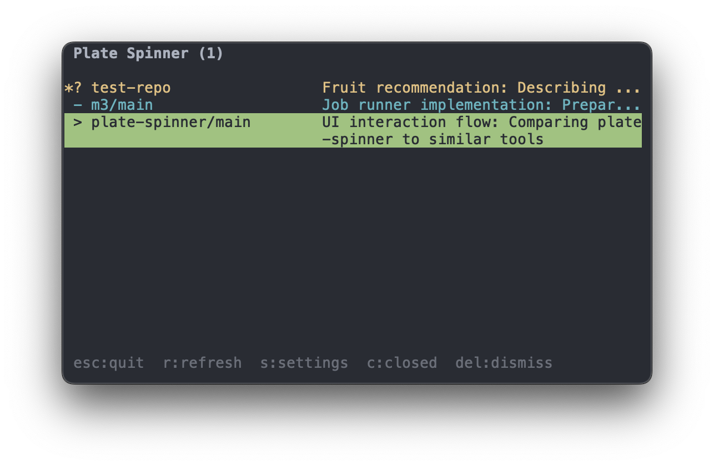
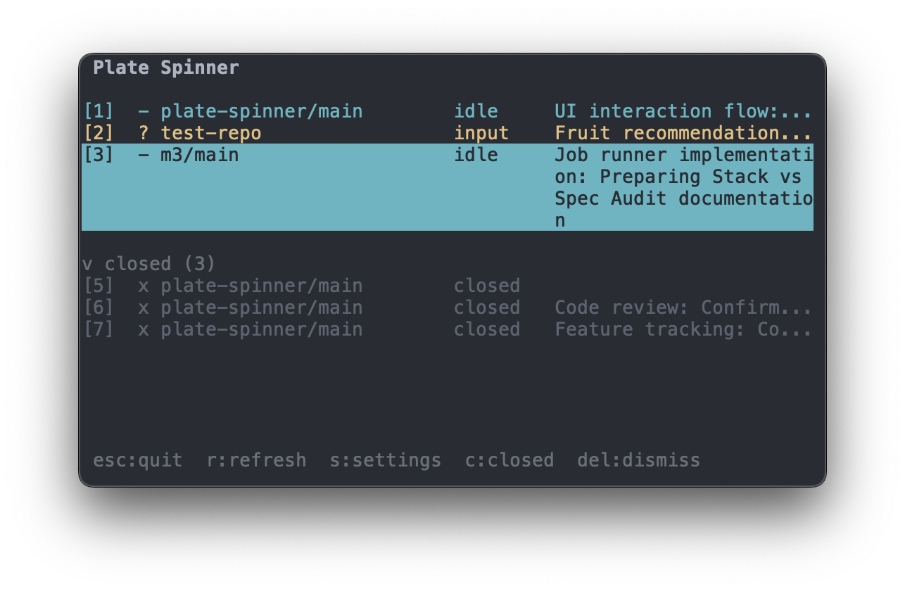

# Plate-Spinner

[](https://crates.io/crates/plate-spinner)
[](https://github.com/nishu-builder/plate-spinner/actions)
[](LICENSE)

Never lose track of a plate you're spinning.
- Status and summaries of each claude code session
- Sound notifications when one needs attention
- Optional tmux integration for window jumping




## Installation

```bash
cargo install plate-spinner
```

Or via installer script:

```bash
curl --proto '=https' --tlsv1.2 -LsSf https://github.com/nishu-builder/plate-spinner/releases/latest/download/plate-spinner-installer.sh | sh
```

## Quick Start

```bash
sp install              # Prints hook config to add to ~/.claude/settings.json
sp auth set             # Configure API key (optional, enables summaries)
sp                      # Open dashboard (terminal 1)
sp run                  # Start tracked plate (terminal 2)
sp run                  # Start another (terminal 3)
```


## Plate States

| Icon | Status | Trigger |
|------|--------|---------|
| `.` | starting | Plate registered, no activity yet |
| `>` | running | Tool executing |
| `?` | awaiting_input | `AskUserQuestion` called |
| `!` | awaiting_approval | `ExitPlanMode` called |
| `-` | idle | Stop event received |
| `X` | error | Stop event with error |
| `x` | closed | Plate wrapper exited |

AI summaries appear when plates reach a waiting state (requires API key, see Authentication below).

## Commands

```
sp              Dashboard (auto-starts daemon)
sp run [args]   Launch Claude with tracking
sp install      Print settings.json hook config
sp kill         Stop daemon
sp plates       List plates as JSON
sp daemon       Run daemon in foreground
sp auth         Show authentication status
  set           Set API key (prompted)
  unset         Remove stored API key
  path          Print auth config path
sp config       Manage configuration
  path          Print config file path
  set <k> <v>   Set a config value
  export        Export config to stdout
  import <file> Import config from file
```

## Architecture

```
Claude Code
    | hooks call `sp hook <type>`
    v
sp hook session-start/pre-tool-use/post-tool-use/stop
    | POST localhost:7890
    v
sp daemon (SQLite + WebSocket) --> sp (TUI)
```

## Configuration

Config file: `~/.config/plate-spinner/config.toml`

### Modes

Plate-spinner has two modes of operation:

**Default mode** (`tmux_mode = false`):
- `sp` runs dashboard directly in your terminal
- `sp run` runs claude directly in your terminal
- Each session runs in its own terminal window
- Dashboard is view-only (Enter does nothing on rows)

**Tmux mode** (`tmux_mode = true`):
- `sp` opens dashboard in a tmux window
- `sp run` creates a new tmux window for each claude session
- All sessions share a tmux session with independent window views
- Press Enter on a dashboard row to jump to that session's window
- Navigate between windows with `ctrl-b w` or dashboard

To enable tmux mode:
```bash
sp config set tmux_mode true
```

Tmux mode requires tmux 3.2+.

### Settings

Press `s` in the dashboard to open the settings menu:

- **Theme**: `default`, `light`, `monochrome`
- **Mode**: `minimal` (compact) or `explicit` (shows row numbers and status text)
- **Sounds**: notification sounds when plates need attention

## Requirements

- Claude Code
- tmux 3.2+ (only if using tmux mode)

## Authentication

AI summaries require an Anthropic API key. Configure it with:

```bash
sp auth set
```

The key is stored in `~/.config/plate-spinner/auth.toml` with restricted permissions (0600).

Alternatively, set the `ANTHROPIC_API_KEY` environment variable (takes precedence over the stored key).

## Development

```bash
cargo build
sp              # daemon auto-restarts if binary changed
```

The daemon includes a build timestamp, so any `sp` command after rebuilding will detect the version mismatch and restart the daemon automatically. TUI changes require quitting (`esc`) and restarting `sp`.

### Testing and Linting

```bash
cargo test                                            # run tests
cargo fmt --all -- --check                            # check formatting
cargo clippy --all-targets --all-features -- -D warnings  # run linter
```

### Git Hooks

Install pre-commit hooks to run formatting and linting checks before each commit:

```bash
./scripts/install-hooks.sh
```
